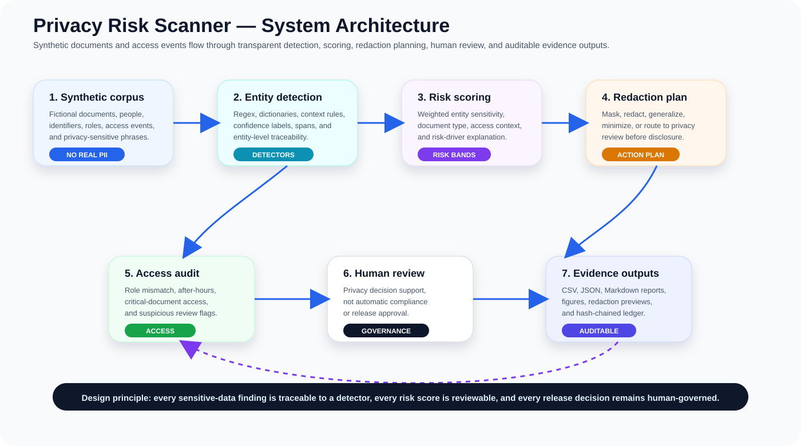
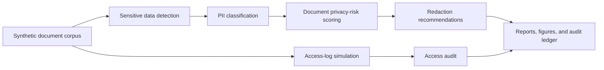

# Personal Data Privacy Risk Scanner

<p align="center"><strong>Research-grade privacy engineering lab for detecting sensitive information in documents, classifying privacy risk, recommending redactions, and auditing access using synthetic data.</strong></p>

<p align="center">
  <a href="../../actions/workflows/python-checks.yml"></a>
  <a href="LICENSE"></a>
  
  
</p>

> **Privacy-review boundary:** this repository uses fictional synthetic documents, people, identifiers, access logs, and privacy events by default. It is research and review-support infrastructure only. It must not be treated as legal compliance certification, automatic disclosure approval, or a substitute for privacy counsel, data-protection officers, security teams, and human review.

---

## Research objective

Can an AI-assisted privacy risk scanner detect sensitive personal information, classify document risk, recommend transparent redactions, and preserve auditable review trails without exposing real private data?

| Research question | Evidence generated locally |
| --- | --- |
| Which documents contain sensitive personal data? | Detected entity table and entity-type counts |
| Which documents carry the highest privacy risk? | Document risk score, risk class, and risk drivers |
| Which text should be redacted or generalized? | Redaction plan with entity-specific actions |
| Which access events need review? | Access audit table and suspicious-access flags |
| Can privacy decisions remain auditable? | Hash-chained audit ledger |
| Can the pipeline run without real private data? | Synthetic fictional document corpus |

---

## Architecture

<p align="center"></p>



---

## Run today — no real private documents needed

```bash
python scripts/run_synthetic_privacy_lab.py
```

Windows quick start:

```bat
cd %USERPROFILE%\personal-data-privacy-risk-scanner
git pull

py -m venv .venv
.venv\Scripts\activate

python -m pip install --upgrade pip
python -m pip install -r requirements.txt
python scripts/run_synthetic_privacy_lab.py
```

Optional controls:

```bash
python scripts/run_synthetic_privacy_lab.py --documents 80 --seed 42
```

---

## Generated local outputs

```text
outputs/results/synthetic_documents.csv
outputs/results/synthetic_detected_entities.csv
outputs/results/synthetic_document_risk.csv
outputs/results/synthetic_redaction_plan.csv
outputs/results/synthetic_access_log.csv
outputs/results/synthetic_access_audit.csv
outputs/results/synthetic_privacy_summary.json
outputs/reports/synthetic_privacy_risk_report.md
outputs/audit/privacy_risk_audit_log.jsonl

outputs/figures/synthetic_entity_type_counts.png
outputs/figures/synthetic_document_risk_distribution.png
outputs/figures/synthetic_redaction_actions.png
outputs/figures/synthetic_access_risk.png
outputs/figures/synthetic_risk_by_document_type.png
```

---

## Sensitive data types included

| Entity type | Example detector |
| --- | --- |
| Person name | Synthetic name pattern and contextual name phrases |
| Email | Regex email detection |
| Phone | International and local phone-like patterns |
| Address | Street/address phrase detection |
| Date of birth | DOB and birth-date context patterns |
| National ID-like pattern | Synthetic ID/token formats only |
| Financial/account-like number | Account/card-like numeric patterns |
| Medical term | Synthetic diagnosis/condition phrase dictionary |
| Location reference | City/region/address context |
| Sensitive free-text phrase | Privacy-sensitive context dictionary |

---

## What the system audits

| Audit area | Examples |
| --- | --- |
| PII detection | Entity type, location, confidence, detection rule |
| Privacy risk | Weighted score, risk class, risk drivers |
| Redaction | Mask, redact, generalize, or require human privacy review |
| Access review | Unusual role access, after-hours access, critical-document access |
| Transparency | Entity evidence, recommended action, hash-chained audit records |

---

## Human governance boundary

This lab supports research, simulation, and privacy review. Real-world deployment requires legal review, data-protection impact assessment, jurisdiction-specific policy validation, security review, access-control integration, retention rules, and human appeal/release workflows.

The system should never be used as the sole basis for legal compliance certification, public document release, employee surveillance, immigration decisions, medical disclosure, financial disclosure, or high-stakes privacy decisions.

---

## Repository map

```text
src/privacyrisk/
  synthetic.py       # fictional documents and access logs
  detector.py        # sensitive data detection rules
  risk.py            # document privacy-risk scoring
  redaction.py       # redaction plan and masked previews
  access.py          # access audit checks
  audit.py           # hash-chained audit ledger
  visualization.py   # local figures
  reporting.py       # Markdown privacy report
scripts/
  run_synthetic_privacy_lab.py
docs/
  methodology.md
  privacy_boundary.md
  synthetic_lab.md
  report_template.md
tests/
  test_synthetic.py
  test_detection.py
  test_pipeline.py
  test_audit.py
```

---

## Limitations

- Synthetic data validates the pipeline but cannot prove real-world legal or privacy compliance.
- Regex and dictionary detectors are transparent baselines, not perfect PII detection models.
- Risk scores are review signals, not legal conclusions.
- Real deployments need privacy counsel, security controls, calibrated detectors, and human review.
