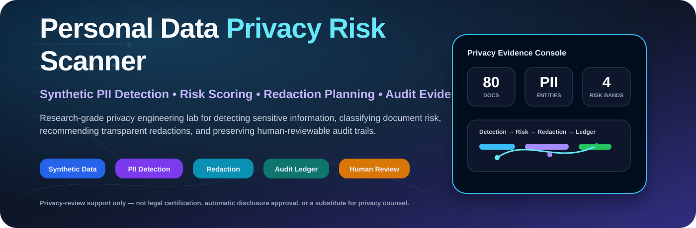
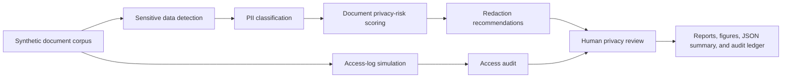
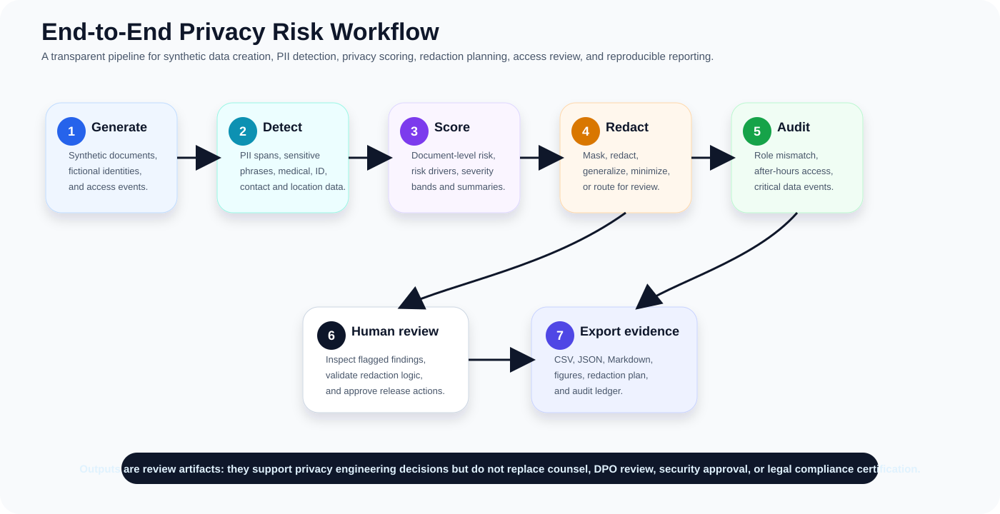
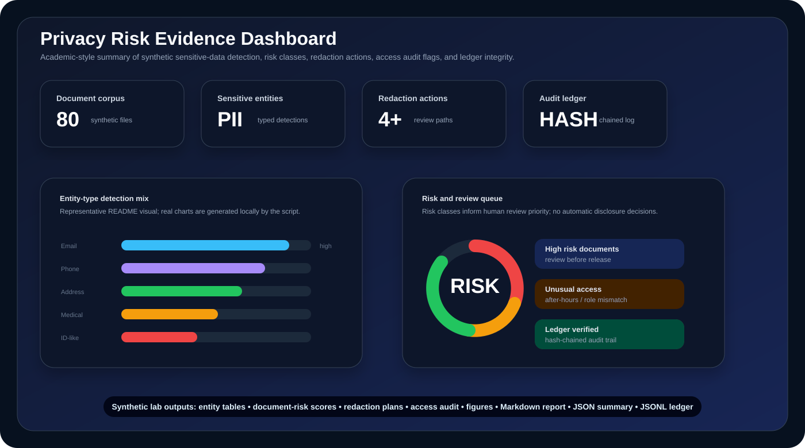

<p align="center">
  
</p>

<h1 align="center">Personal Data Privacy Risk Scanner</h1>

<p align="center">
  <b>Research-grade privacy engineering lab for detecting sensitive information, classifying privacy risk, recommending transparent redactions, auditing suspicious access, and preserving human-reviewable evidence using synthetic data.</b>
</p>

<p align="center">
  <a href="../../actions/workflows/python-checks.yml"></a>
  <a href="LICENSE"></a>
  
  
  
</p>

---

## Overview

**Personal Data Privacy Risk Scanner** is a simulation-first privacy engineering project for studying how sensitive-data discovery, risk scoring, redaction planning, and access-event auditing can be made transparent, reproducible, and safe to evaluate without exposing real private data.

The project uses fictional documents, fictional people, synthetic identifiers, synthetic access logs, and synthetic privacy events by default. It is designed for research, teaching, prototyping, and internal privacy-engineering experiments where the pipeline should be explainable from input to final report.

> **Privacy-review boundary:** this repository is review-support infrastructure only. It must not be treated as legal compliance certification, automatic disclosure approval, or a substitute for privacy counsel, data-protection officers, security teams, or human review.

---

## Research objective

Can an AI-assisted privacy risk scanner detect sensitive personal information, classify document risk, recommend transparent redactions, and preserve auditable review trails without exposing real private data?

| Research question | Evidence generated locally |
|---|---|
| Which documents contain sensitive personal data? | Detected entity table and entity-type counts |
| Which documents carry the highest privacy risk? | Document risk score, risk class, and risk drivers |
| Which text should be redacted, masked, or generalized? | Redaction plan with entity-specific actions |
| Which access events need human review? | Access audit table and suspicious-access flags |
| Can privacy decisions remain auditable? | Hash-chained audit ledger |
| Can the pipeline run without real private data? | Synthetic fictional document corpus |

---

## Academic system architecture

<p align="center">
  
</p>



The architecture separates detection, scoring, redaction, access review, and final evidence generation so each privacy decision can be traced back to a detector, document, rule, and review artifact.

---

## End-to-end workflow

<p align="center">
  
</p>

| Step | Action | Output |
|---:|---|---|
| 1 | Generate fictional documents and access logs | Synthetic corpus and metadata |
| 2 | Detect sensitive entities and context phrases | Entity table with spans, types, and confidence |
| 3 | Score document-level privacy risk | Risk class, risk drivers, and distribution figures |
| 4 | Build redaction plan | Mask, redact, generalize, minimize, or review actions |
| 5 | Audit access events | Suspicious-event flags and review queue |
| 6 | Route findings to human governance | Human-readable review artifacts |
| 7 | Export reproducible evidence | CSV, JSON, Markdown, figures, and JSONL ledger |

---

## Evidence dashboard

<p align="center">
  
</p>

| Evidence family | Files and records | Why it matters |
|---|---|---|
| Document corpus | `synthetic_documents.csv` | Confirms the pipeline can run without real private documents |
| Entity detection | `synthetic_detected_entities.csv` | Shows every detected span, type, and detection rule |
| Risk scoring | `synthetic_document_risk.csv` | Makes document-level privacy risk explainable |
| Redaction planning | `synthetic_redaction_plan.csv` | Converts findings into human-reviewable actions |
| Access auditing | `synthetic_access_log.csv`, `synthetic_access_audit.csv` | Flags unusual access patterns and review needs |
| Summary report | `synthetic_privacy_summary.json`, `synthetic_privacy_risk_report.md` | Provides machine-readable and human-readable outputs |
| Audit ledger | `privacy_risk_audit_log.jsonl` | Preserves a hash-chained trace of important pipeline events |

---

## Run today — no real private documents needed

```bash
python scripts/run_synthetic_privacy_lab.py
```

Windows quick start:

```bat
cd %USERPROFILE%\personal-data-privacy-risk-scanner
git pull

py -m venv .venv
.venv\Scripts\activate

python -m pip install --upgrade pip
python -m pip install -r requirements.txt
python scripts/run_synthetic_privacy_lab.py
```

Optional controls:

```bash
python scripts/run_synthetic_privacy_lab.py --documents 80 --seed 42
```

---

## Generated local outputs

```text
outputs/results/synthetic_documents.csv
outputs/results/synthetic_detected_entities.csv
outputs/results/synthetic_document_risk.csv
outputs/results/synthetic_redaction_plan.csv
outputs/results/synthetic_access_log.csv
outputs/results/synthetic_access_audit.csv
outputs/results/synthetic_privacy_summary.json
outputs/reports/synthetic_privacy_risk_report.md
outputs/audit/privacy_risk_audit_log.jsonl

outputs/figures/synthetic_entity_type_counts.png
outputs/figures/synthetic_document_risk_distribution.png
outputs/figures/synthetic_redaction_actions.png
outputs/figures/synthetic_access_risk.png
outputs/figures/synthetic_risk_by_document_type.png
```

---

## Sensitive data types included

| Entity type | Example detector | Example review concern |
|---|---|---|
| Person name | Synthetic name pattern and contextual name phrases | Re-identification risk |
| Email | Regex email detection | Contact exposure |
| Phone | International and local phone-like patterns | Contact exposure |
| Address | Street/address phrase detection | Location privacy |
| Date of birth | DOB and birth-date context patterns | Identity linkage |
| National ID-like pattern | Synthetic ID/token formats only | High-sensitivity identifier |
| Financial/account-like number | Account/card-like numeric patterns | Financial privacy |
| Medical term | Synthetic diagnosis/condition phrase dictionary | Health privacy |
| Location reference | City/region/address context | Location inference |
| Sensitive free-text phrase | Privacy-sensitive context dictionary | Contextual disclosure risk |

---

## What the system audits

| Audit area | Examples | Output artifact |
|---|---|---|
| PII detection | Entity type, location, confidence, detection rule | Detected entity table |
| Privacy risk | Weighted score, risk class, risk drivers | Document risk report |
| Redaction | Mask, redact, generalize, or require human privacy review | Redaction plan |
| Access review | Unusual role access, after-hours access, critical-document access | Access audit table |
| Transparency | Entity evidence, recommended action, hash-chained audit records | Audit ledger |

---

## Repository map

```text
src/privacyrisk/
  synthetic.py       # fictional documents and access logs
  detector.py        # sensitive data detection rules
  risk.py            # document privacy-risk scoring
  redaction.py       # redaction plan and masked previews
  access.py          # access audit checks
  audit.py           # hash-chained audit ledger
  visualization.py   # local figures
  reporting.py       # Markdown privacy report
scripts/
  run_synthetic_privacy_lab.py
assets/
  banner.svg
  privacy_risk_architecture.svg
  privacy-risk-workflow.svg
  privacy-risk-dashboard.svg
docs/
  methodology.md
  privacy_boundary.md
  synthetic_lab.md
  report_template.md
tests/
  test_synthetic.py
  test_detection.py
  test_pipeline.py
  test_audit.py
```

---

## Human governance boundary

This lab supports research, simulation, and privacy review. Real-world deployment requires legal review, data-protection impact assessment, jurisdiction-specific policy validation, security review, access-control integration, retention rules, and human appeal or release workflows.

The system should never be used as the sole basis for legal compliance certification, public document release, employee surveillance, immigration decisions, medical disclosure, financial disclosure, or high-stakes privacy decisions.

---

## Limitations

- Synthetic data validates the pipeline but cannot prove real-world legal or privacy compliance.
- Regex and dictionary detectors are transparent baselines, not perfect PII detection models.
- Risk scores are review signals, not legal conclusions.
- Redaction recommendations require human privacy review before any real release.
- Real deployments need privacy counsel, security controls, calibrated detectors, retention policies, access-control integration, and human appeal workflows.

---

## Maintainer

Maintained by **Hira Khyzer** as a research-oriented privacy engineering project for synthetic sensitive-data discovery, redaction planning, risk analysis, and auditable privacy review.